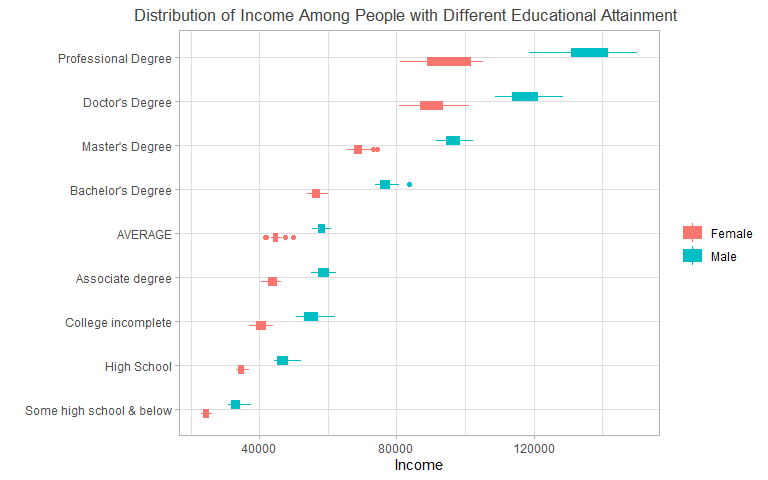

## About the Data

#### Cover Date: 2019
#### Web Release: January 2020

## Description
This data visualization is created based on the dataset summarize trends in adult annual income between 1990 and 2019 based on their educational attainment : some high school & below, high school, college incomplete, associate degree, average, bachelor, master, doctor, professional. This visualization is based on the data from sample surveys of the noninstitutionalized population since the 1990s, which excludes persons living in institutions (e.g., prisons ,nursing facilities and military barracks).


```r
data %>% 
  select(-total) %>% 
  mutate(`Some high school & below` = (`high school not complete` + `Less than 9th degree`)/2) %>% 
  pivot_longer(cols = `Total`:`Some high school & below`, names_to = "degree", values_to = "income") %>% 
  mutate(degree = ifelse(degree == "Total", "AVERAGE", degree),
         degree = ifelse(degree == "college no degree", "College incomplete", degree)) %>% 
  filter(degree != "high school not complete" & degree != "Less than 9th degree") %>% 
  ggplot()+
  geom_boxplot(aes(y = fct_reorder(degree, income, .fun = median, na.rm = TRUE), x = income, color = Gender, fill = Gender),width = 0.4,varwidth = TRUE)+
  
  labs(x = "Income",
       y = "",
       title = "Distribution of Income Among People with Different Educational Attainment",
       color = "",
       fill = "")+
  theme_light()+
  theme(plot.title = element_text(size = 13,hjust = 0.7,color = "#414141"))
```




## Interpretation

According to the dataset, the income(constant 2019 dollars) has very limited variation throughout the years. Thus we decide not to include the years in the visualizations. The visualizations are consistent with common sense that the lower educational attainment would correspond with lower income on average. In addition, it shows an increasingly wider gap between genders with the increase of educational attainment.
