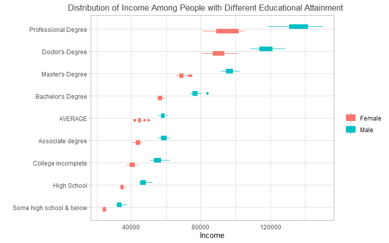

# BAD EXAMPLE


```r
data %>% 
  select(-total) %>% 
  mutate(`Some high school & below` = (`high school not complete` + `Less than 9th degree`)/2) %>% 
  pivot_longer(cols = `Total`:`Some high school & below`, names_to = "degree", values_to = "income") %>% 
  mutate(degree = ifelse(degree == "Total", "AVERAGE", degree),
         degree = ifelse(degree == "college no degree", "College incomplete", degree)) %>% 
  filter(degree != "high school not complete" & degree != "Less than 9th degree") %>% 
  ggplot()+
  geom_boxplot(aes(y = fct_reorder(degree, income, .fun = median, na.rm = TRUE), x = income, color = Gender, fill = Gender),width = 0.4,varwidth = TRUE)+
  
  labs(x = "Income",
       y = "",
       title = "Distribution of Income Among People with Different Educational Attainment",
       color = "",
       fill = "")+
  theme_light()+
  theme(plot.title = element_text(size = 13,hjust = 0.7,color = "#414141"))
```




# GOOD EXAMPLE

## Distribution of Income Among People with Different Educational Attainment

#### Description
This data visualization is created based on the dataset summarize trends in adult annual income between 1990 and 2019 based on their educational attainment : some high school & below, high school, college incomplete, associate degree, average, bachelor, master, doctor, professional. This visualization is based on the data from sample surveys of the noninstitutionalized population since the 1990s, which excludes persons living in institutions (e.g., prisons ,nursing facilities and military barracks).


```r
data %>% 
  select(-total) %>% 
  mutate(`Some high school & below` = (`high school not complete` + `Less than 9th degree`)/2) %>% 
  pivot_longer(cols = `Total`:`Some high school & below`, names_to = "degree", values_to = "income") %>% 
  mutate(degree = ifelse(degree == "Total", "AVERAGE", degree),
         degree = ifelse(degree == "college no degree", "College incomplete", degree)) %>% 
  filter(degree != "high school not complete" & degree != "Less than 9th degree") %>% 
  ggplot()+
  geom_boxplot(aes(y = fct_reorder(degree, income, .fun = median, na.rm = TRUE), x = income, color = Gender, fill = Gender),width = 0.4,varwidth = TRUE)+
  
  labs(x = "Income",
       y = "",
       title = "Distribution of Income Among People with Different Educational Attainment",
       color = "",
       fill = "")+
  theme_light()+
  theme(plot.title = element_text(size = 13,hjust = 0.7,color = "#414141"))
```


```r
datas <- data %>% 
  select(-total) %>% 
  mutate(`Some high school & below` = (`high school not complete` + `Less than 9th degree`)/2) %>% 
  pivot_longer(cols = `Total`:`Some high school & below`, names_to = "degree", values_to = "income") %>% 
  mutate(degree = ifelse(degree == "Total", "AVERAGE", degree),
         degree = ifelse(degree == "college no degree", "College incomplete", degree)) %>% 
  filter(degree != "high school not complete" & degree != "Less than 9th degree")

datatable(datas, rownames = FALSE, caption = "Table of the annual income of people with different educational attainment from 1990 to 2019")
```

```{=html}
<div id="htmlwidget-5828cef97759308905e8" style="width:100%;height:auto;" class="datatables html-widget"></div>
<script type="application/json" data-for="htmlwidget-5828cef97759308905e8">{"x":{"filter":"none","vertical":false,"caption":"<caption>Table of the annual income of people with different educational attainment from 1990 to 2019<\/caption>","data":[["Male","Male","Male","Male","Male","Male","Male","Male","Male","Male","Male","Male","Male","Male","Male","Male","Male","Male","Male","Male","Male","Male","Male","Male","Male","Male","Male","Male","Male","Male","Male","Male","Male","Male","Male","Male","Male","Male","Male","Male","Male","Male","Male","Male","Male","Male","Male","Male","Male","Male","Male","Male","Male","Male","Male","Male","Male","Male","Male","Male","Male","Male","Male","Male","Male","Male","Male","Male","Male","Male","Male","Male","Male","Male","Male","Male","Male","Male","Male","Male","Male","Male","Male","Male","Male","Male","Male","Male","Male","Male","Male","Male","Male","Male","Male","Male","Male","Male","Male","Male","Male","Male","Male","Male","Male","Male","Male","Male","Male","Male","Male","Male","Male","Male","Male","Male","Male","Male","Male","Male","Male","Male","Male","Male","Male","Male","Male","Male","Male","Male","Male","Male","Male","Male","Male","Male","Male","Male","Male","Male","Male","Male","Male","Male","Male","Male","Male","Male","Male","Male","Male","Male","Male","Male","Male","Male","Male","Male","Male","Male","Male","Male","Male","Male","Male","Male","Male","Male","Male","Male","Male","Male","Male","Male","Male","Male","Male","Male","Male","Male","Male","Male","Male","Male","Male","Male","Male","Male","Male","Male","Male","Male","Male","Male","Male","Male","Male","Male","Female","Female","Female","Female","Female","Female","Female","Female","Female","Female","Female","Female","Female","Female","Female","Female","Female","Female","Female","Female","Female","Female","Female","Female","Female","Female","Female","Female","Female","Female","Female","Female","Female","Female","Female","Female","Female","Female","Female","Female","Female","Female","Female","Female","Female","Female","Female","Female","Female","Female","Female","Female","Female","Female","Female","Female","Female","Female","Female","Female","Female","Female","Female","Female","Female","Female","Female","Female","Female","Female","Female","Female","Female","Female","Female","Female","Female","Female","Female","Female","Female","Female","Female","Female","Female","Female","Female","Female","Female","Female","Female","Female","Female","Female","Female","Female","Female","Female","Female","Female","Female","Female","Female","Female","Female","Female","Female","Female","Female","Female","Female","Female","Female","Female","Female","Female","Female","Female","Female","Female","Female","Female","Female","Female","Female","Female","Female","Female","Female","Female","Female","Female","Female","Female","Female","Female","Female","Female","Female","Female","Female","Female","Female","Female","Female","Female","Female","Female","Female","Female","Female","Female","Female","Female","Female","Female","Female","Female","Female","Female","Female","Female","Female","Female","Female","Female","Female","Female","Female","Female","Female","Female","Female","Female","Female","Female","Female","Female","Female","Female","Female","Female","Female","Female","Female","Female","Female","Female","Female","Female","Female","Female","Female","Female","Female","Female","Female","Female"],[1990,1990,1990,1990,1990,1990,1990,1990,1990,1995,1995,1995,1995,1995,1995,1995,1995,1995,2000,2000,2000,2000,2000,2000,2000,2000,2000,2001,2001,2001,2001,2001,2001,2001,2001,2001,2002,2002,2002,2002,2002,2002,2002,2002,2002,2003,2003,2003,2003,2003,2003,2003,2003,2003,2004,2004,2004,2004,2004,2004,2004,2004,2004,2005,2005,2005,2005,2005,2005,2005,2005,2005,2006,2006,2006,2006,2006,2006,2006,2006,2006,2007,2007,2007,2007,2007,2007,2007,2007,2007,2008,2008,2008,2008,2008,2008,2008,2008,2008,2009,2009,2009,2009,2009,2009,2009,2009,2009,2010,2010,2010,2010,2010,2010,2010,2010,2010,2011,2011,2011,2011,2011,2011,2011,2011,2011,2012,2012,2012,2012,2012,2012,2012,2012,2012,2013,2013,2013,2013,2013,2013,2013,2013,2013,2014,2014,2014,2014,2014,2014,2014,2014,2014,2015,2015,2015,2015,2015,2015,2015,2015,2015,2016,2016,2016,2016,2016,2016,2016,2016,2016,2017,2017,2017,2017,2017,2017,2017,2017,2017,2018,2018,2018,2018,2018,2018,2018,2018,2018,2019,2019,2019,2019,2019,2019,2019,2019,2019,1990,1990,1990,1990,1990,1990,1990,1990,1990,1995,1995,1995,1995,1995,1995,1995,1995,1995,2000,2000,2000,2000,2000,2000,2000,2000,2000,2001,2001,2001,2001,2001,2001,2001,2001,2001,2002,2002,2002,2002,2002,2002,2002,2002,2002,2003,2003,2003,2003,2003,2003,2003,2003,2003,2004,2004,2004,2004,2004,2004,2004,2004,2004,2005,2005,2005,2005,2005,2005,2005,2005,2005,2006,2006,2006,2006,2006,2006,2006,2006,2006,2007,2007,2007,2007,2007,2007,2007,2007,2007,2008,2008,2008,2008,2008,2008,2008,2008,2008,2009,2009,2009,2009,2009,2009,2009,2009,2009,2010,2010,2010,2010,2010,2010,2010,2010,2010,2011,2011,2011,2011,2011,2011,2011,2011,2011,2012,2012,2012,2012,2012,2012,2012,2012,2012,2013,2013,2013,2013,2013,2013,2013,2013,2013,2014,2014,2014,2014,2014,2014,2014,2014,2014,2015,2015,2015,2015,2015,2015,2015,2015,2015,2016,2016,2016,2016,2016,2016,2016,2016,2016,2017,2017,2017,2017,2017,2017,2017,2017,2017,2018,2018,2018,2018,2018,2018,2018,2018,2018,2019,2019,2019,2019,2019,2019,2019,2019,2019],["AVERAGE","High School","College incomplete","Associate degree","Bachelor's Degree","Master's Degree","Professional Degree","Doctor's Degree","Some high school &amp; below","AVERAGE","High School","College incomplete","Associate degree","Bachelor's Degree","Master's Degree","Professional Degree","Doctor's Degree","Some high school &amp; below","AVERAGE","High School","College incomplete","Associate degree","Bachelor's Degree","Master's Degree","Professional Degree","Doctor's Degree","Some high school &amp; below","AVERAGE","High School","College incomplete","Associate degree","Bachelor's Degree","Master's Degree","Professional Degree","Doctor's Degree","Some high school &amp; below","AVERAGE","High School","College incomplete","Associate degree","Bachelor's Degree","Master's Degree","Professional Degree","Doctor's Degree","Some high school &amp; below","AVERAGE","High School","College incomplete","Associate degree","Bachelor's Degree","Master's Degree","Professional Degree","Doctor's Degree","Some high school &amp; below","AVERAGE","High School","College incomplete","Associate degree","Bachelor's Degree","Master's Degree","Professional Degree","Doctor's Degree","Some high school &amp; below","AVERAGE","High School","College incomplete","Associate degree","Bachelor's Degree","Master's Degree","Professional Degree","Doctor's Degree","Some high school &amp; below","AVERAGE","High School","College incomplete","Associate degree","Bachelor's Degree","Master's Degree","Professional Degree","Doctor's Degree","Some high school &amp; below","AVERAGE","High School","College incomplete","Associate degree","Bachelor's Degree","Master's Degree","Professional Degree","Doctor's Degree","Some high school &amp; below","AVERAGE","High School","College incomplete","Associate degree","Bachelor's Degree","Master's Degree","Professional Degree","Doctor's Degree","Some high school &amp; below","AVERAGE","High School","College incomplete","Associate degree","Bachelor's Degree","Master's Degree","Professional Degree","Doctor's Degree","Some high school &amp; below","AVERAGE","High School","College incomplete","Associate degree","Bachelor's Degree","Master's Degree","Professional Degree","Doctor's Degree","Some high school &amp; below","AVERAGE","High School","College incomplete","Associate degree","Bachelor's Degree","Master's Degree","Professional Degree","Doctor's Degree","Some high school &amp; below","AVERAGE","High School","College incomplete","Associate degree","Bachelor's Degree","Master's Degree","Professional Degree","Doctor's Degree","Some high school &amp; below","AVERAGE","High School","College incomplete","Associate degree","Bachelor's Degree","Master's Degree","Professional Degree","Doctor's Degree","Some high school &amp; below","AVERAGE","High School","College incomplete","Associate degree","Bachelor's Degree","Master's Degree","Professional Degree","Doctor's Degree","Some high school &amp; below","AVERAGE","High School","College incomplete","Associate degree","Bachelor's Degree","Master's Degree","Professional Degree","Doctor's Degree","Some high school &amp; below","AVERAGE","High School","College incomplete","Associate degree","Bachelor's Degree","Master's Degree","Professional Degree","Doctor's Degree","Some high school &amp; below","AVERAGE","High School","College incomplete","Associate degree","Bachelor's Degree","Master's Degree","Professional Degree","Doctor's Degree","Some high school &amp; below","AVERAGE","High School","College incomplete","Associate degree","Bachelor's Degree","Master's Degree","Professional Degree","Doctor's Degree","Some high school &amp; below","AVERAGE","High School","College incomplete","Associate degree","Bachelor's Degree","Master's Degree","Professional Degree","Doctor's Degree","Some high school &amp; below","AVERAGE","High School","College incomplete","Associate degree","Bachelor's Degree","Master's Degree","Professional Degree","Doctor's Degree","Some high school &amp; below","AVERAGE","High School","College incomplete","Associate degree","Bachelor's Degree","Master's Degree","Professional Degree","Doctor's Degree","Some high school &amp; below","AVERAGE","High School","College incomplete","Associate degree","Bachelor's Degree","Master's Degree","Professional Degree","Doctor's Degree","Some high school &amp; below","AVERAGE","High School","College incomplete","Associate degree","Bachelor's Degree","Master's Degree","Professional Degree","Doctor's Degree","Some high school &amp; below","AVERAGE","High School","College incomplete","Associate degree","Bachelor's Degree","Master's Degree","Professional Degree","Doctor's Degree","Some high school &amp; below","AVERAGE","High School","College incomplete","Associate degree","Bachelor's Degree","Master's Degree","Professional Degree","Doctor's Degree","Some high school &amp; below","AVERAGE","High School","College incomplete","Associate degree","Bachelor's Degree","Master's Degree","Professional Degree","Doctor's Degree","Some high school &amp; below","AVERAGE","High School","College incomplete","Associate degree","Bachelor's Degree","Master's Degree","Professional Degree","Doctor's Degree","Some high school &amp; below","AVERAGE","High School","College incomplete","Associate degree","Bachelor's Degree","Master's Degree","Professional Degree","Doctor's Degree","Some high school &amp; below","AVERAGE","High School","College incomplete","Associate degree","Bachelor's Degree","Master's Degree","Professional Degree","Doctor's Degree","Some high school &amp; below","AVERAGE","High School","College incomplete","Associate degree","Bachelor's Degree","Master's Degree","Professional Degree","Doctor's Degree","Some high school &amp; below","AVERAGE","High School","College incomplete","Associate degree","Bachelor's Degree","Master's Degree","Professional Degree","Doctor's Degree","Some high school &amp; below","AVERAGE","High School","College incomplete","Associate degree","Bachelor's Degree","Master's Degree","Professional Degree","Doctor's Degree","Some high school &amp; below","AVERAGE","High School","College incomplete","Associate degree","Bachelor's Degree","Master's Degree","Professional Degree","Doctor's Degree","Some high school &amp; below","AVERAGE","High School","College incomplete","Associate degree","Bachelor's Degree","Master's Degree","Professional Degree","Doctor's Degree","Some high school &amp; below","AVERAGE","High School","College incomplete","Associate degree","Bachelor's Degree","Master's Degree","Professional Degree","Doctor's Degree","Some high school &amp; below","AVERAGE","High School","College incomplete","Associate degree","Bachelor's Degree","Master's Degree","Professional Degree","Doctor's Degree","Some high school &amp; below","AVERAGE","High School","College incomplete","Associate degree","Bachelor's Degree","Master's Degree","Professional Degree","Doctor's Degree","Some high school &amp; below","AVERAGE","High School","College incomplete","Associate degree","Bachelor's Degree","Master's Degree","Professional Degree","Doctor's Degree","Some high school &amp; below","AVERAGE","High School","College incomplete","Associate degree","Bachelor's Degree","Master's Degree","Professional Degree","Doctor's Degree","Some high school &amp; below","AVERAGE","High School","College incomplete","Associate degree","Bachelor's Degree","Master's Degree","Professional Degree","Doctor's Degree","Some high school &amp; below","AVERAGE","High School","College incomplete","Associate degree","Bachelor's Degree","Master's Degree","Professional Degree","Doctor's Degree","Some high school &amp; below"],[60130,52150,62090,null,76780,null,null,null,37465,57970,49510,56850,59060,75940,92640,133660,109620,34005,60960,50930,59890,62280,83640,101430,147590,119140,34060,60090,50130,59260,61760,80750,102370,144380,125560,34340,58490,47200,58060,60910,79700,95630,142130,118400,33275,58290,49210,57460,59580,78520,98170,138980,121090,33135,56960,48350,56710,60100,77450,96820,135350,111530,32445,56710,47520,55530,61760,78570,98220,130910,112400,32410,58030,46960,55590,59700,77240,95660,126820,126820,31935,57960,46680,55360,60470,76550,94060,123300,113550,32485,58180,46320,54410,59550,78130,96140,118740,118740,32020,59580,47040,56120,59940,74410,94550,146860,120050,30960,59050,46960,54440,58950,74730,94920,135180,118680,31590,57570,45970,53500,57880,75240,94370,135790,114530,31625,56740,44930,52540,56750,73660,94780,129560,118550,30875,56100,44210,52290,55970,73790,94720,139070,115540,31125,55500,44200,50640,55200,73610,91530,131490,108760,31005,56420,44840,53580,56170,77000,93560,141510,110380,31980,57250,44620,52450,55520,76300,94200,125210,128280,33470,58020,44260,53030,57050,75090,95540,132700,123540,34220,58470,46400,52630,57750,76510,101420,137890,117890,34315,60610,46850,53810,58800,77090,100560,150100,128650,34645,41820,35840,43490,null,54820,null,null,null,26100,41730,34330,40260,45820,53770,67550,83890,80770,24665,45030,37070,42610,46130,60000,74440,87530,84750,25025,45270,36530,43920,46420,59190,73160,89150,89700,25880,44070,35790,41790,44950,58060,69490,81040,93400,25455,43870,36240,41890,44820,57430,69710,92410,93410,24910,43300,35230,41710,45320,56420,69460,101560,93220,24490,43300,34410,41100,44430,55210,67300,105330,87520,23740,44510,33910,40520,44590,57590,66500,96690,89430,24265,44490,33590,40490,44800,56440,68340,87670,85060,23835,43580,33700,38740,43650,55840,68290,84660,87900,23180,44410,34740,40620,44410,55810,72770,99990,91260,23655,44900,35010,39160,44290,55610,69290,89970,90740,22930,44220,34110,39320,44650,55810,68540,91740,88040,23425,44520,33860,39040,41560,55870,67840,105200,86750,23075,44570,33800,38680,41380,55690,67250,93720,82410,23095,44090,33100,37120,40470,55450,65690,99150,86980,23205,44960,33710,38990,43350,55750,67280,88960,88780,23580,45810,33600,39290,42840,55420,69140,98030,92000,25040,46530,33630,38200,42390,54690,71450,104480,95990,24935,47420,33210,39540,42240,57710,67950,101590,96900,24485,49680,35100,40810,42300,57420,70810,102460,101170,25650]],"container":"<table class=\"display\">\n  <thead>\n    <tr>\n      <th>Gender<\/th>\n      <th>Year<\/th>\n      <th>degree<\/th>\n      <th>income<\/th>\n    <\/tr>\n  <\/thead>\n<\/table>","options":{"columnDefs":[{"className":"dt-right","targets":[1,3]}],"order":[],"autoWidth":false,"orderClasses":false}},"evals":[],"jsHooks":[]}</script>
```


